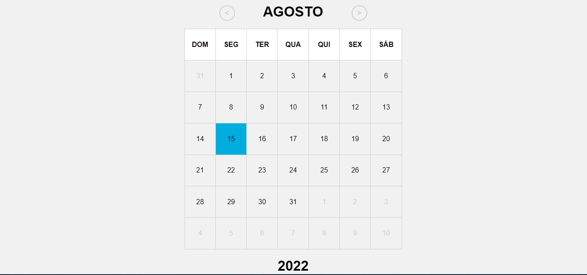

 

# Olá, devs 👋!	

Aqui estão algumas idéias sobre mim para você começar:

- 🌱 Atualmente estou estudando **(Javascript, ReactJS e TypeScript(*agendado*))**;
- 👯 Estou procurando colaborar no desenvolvimento social e projetos open-source;
- 🤔 Estou procurando ajuda para muitos projetos, tente entrar em contato comigo!:
- 💬 Me pergunte sobre qualquer coisa **[Paulo Pessoa](mailto:mrcerebro8@gmail.com)**.

## Projecto : CALENDÁRIO PERSONALIZADO

## Visualizar o projecto

[calendario-v1](https://mr-cerebro.github.io/calendar_v1/)

## Redes Sociais

- Behance: [Paulo Pessoa](https://www.behance.net/mr-cerebro)
- Dribble: [Paulo Pessoa](https://dribbble.com/mr-cerebro)
- Facebook: [Paulo Pessoa](https://www.facebook.com/paulo1pessoa)
- Instagram: [Paulo Pessoa](https://www.instagram.com/_mrcerebro/)
- Linkedin: [Paulo Pessoa](https://www.linkedin.com/in/paulo-pessoa-2777841b2/)
- Twitter: [Paulo Pessoa](https://twitter.com/PauloPe65041263)

# Hello devs 👋!

Here are some ideas about me to get you started:

- 🌱 I'm currently studying **(Javascript, ReactJS and TypeScript(*scheduled*))**;
- 👯 I'm looking to collaborate on social development and open-source projects;
- 🤔 I'm looking for help for many projects, try contacting me!:
- 💬 Ask me about anything **[Paulo Pessoa](mailto:mrcerebro8@gmail.com)**.

## Project: COLORS GAME RGB

## View the project

[calendario-v1](https://mr-cerebro.github.io/calendar_v1/)

## Social networks

- Behance: [Paulo Pessoa](https://www.behance.net/mr-cerebro)
- Dribble: [Paulo Pessoa](https://dribbble.com/mr-cerebro)
- Facebook: [Paulo Pessoa](https://www.facebook.com/paulo1pessoa)
- Instagram: [Paulo Pessoa](https://www.instagram.com/_mrcerebro/)
- Linkedin: [Paulo Pessoa](https://www.linkedin.com/in/paulo-pessoa-2777841b2/)
- Twitter: [Paulo Pessoa](https://twitter.com/PauloPe65041263)
